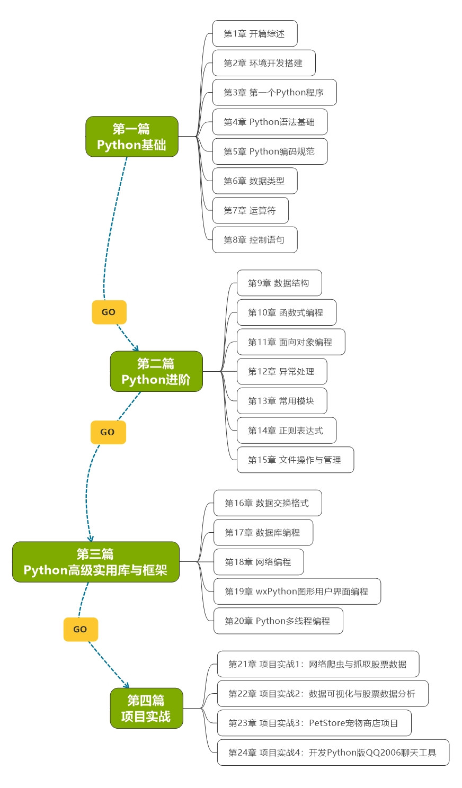

[《Python从小白到大牛》已经上市！](https://item.jd.com/12468732.html?dist=jd)

本书是一部系统论述Python编程语言、OOP编程思想以及函数式编程思想的立体化教程（含纸质图书、电子书、教学课件、源代码与视频教程）。为便于读者高效学习，快速掌握Python编程方法。本书作者精心制作了电子书、完整的教学课件、完整的源代码与丰富的配套视频教程以及在线答疑服务等内容。

>   第一篇 Python基础

本篇包括8章内容，系统介绍了Python语言的基础知识。内容包括Python语言历史，Python语言的特点，开发环境的搭建，创建第一个Python程序，Python语法基础，Python编码规范，数据类型，运算符和控制语句。通过本篇的学习，读者可以全面了解Python的发展及特点，详细了解Python的语法规范，初步掌握Python程序设计的基本方法。

第1章 开篇综述

第2章 开发环境搭建

第3章 第一个Python程序

第4章 Python语法基础

第5章 Python编码规范

第6章 数据类型

第7章 运算符

第8章 控制语句

>   第二篇 Python进阶

本篇包括7章内容，系统介绍了Python语言进阶相关知识。内容包括Python数据结构，函数式编程，面向对象，异常处理，常用模块，正则表达式和文件操作与管理。通过本篇的学习，读者可以全面了解Python语言的进阶知识。

第9章 数据结构

第10章 函数式编程

第11章 面向对象编程

第12章 异常处理

第13章 常用模块

第14章 正则表达式

第15章 文件操作与管理

>   第三篇 Python高级实用库与框架

本篇包括5章内容，介绍了Python实际开发中高级实用库与框架。内容包括数据交换格式，数据库编程，网络编程，wxPython图形用户界面编程，多线程编程和游戏开发引擎。通过本篇的学习，读者可以全面了解Python编程中一些实用库与框架，熟悉这些库与框架的使用。

第16章 数据交换格式

第17章 数据库编程

第18章 网络编程

第19章 wxPython图形用户界面编程

第20章 Python多线程编程

>   第四篇 项目实战

本篇包括5章内容，通过4个项目介绍了Python项目开发过程以及相关的技术。内容包括项目实战1：网络爬虫与抓取股票数据，项目实战2：数据可视化与股票数据分析，项目实战3：开发PetStore宠物商店项目和项目实战4：开发Python版QQ2006聊天工具。通过本篇的学习，读者书中介绍的Python知识应用于实际项目开发，并进一步消化和吸收书中所讲。了解项目开发过程。

第21章 项目实战1：网络爬虫与抓取股票数据

第22章 项目实战2：数据可视化与股票数据分析

第23章 项目实战3：开发PetStore宠物商店项目

第24章 项目实战4：开发Python版QQ2006聊天工具

## 本书学习路线图

## 本书服务网址
为了更好地为广大读者提供服务，我们专门为本书建立了一个服务网址http://www.zhijieketang.com/group/8 ，希望读者对书中内容发表评论，提出宝贵意见。

## 配套视频
http://www.zhijieketang.com/classroom/10/courses

## 配套源代码
http://www.zhijieketang.com/group/8

## 电子书
https://yuedu.baidu.com/ebook/5823871e59fafab069dc5022aaea998fcc2240fc

## 联系我们
##### 作者微博：@tony_关东升
##### 邮箱：eorient@sina.com
##### 智捷课堂微信公共号：zhijieketang
##### Python读者服务QQ群：628808216
